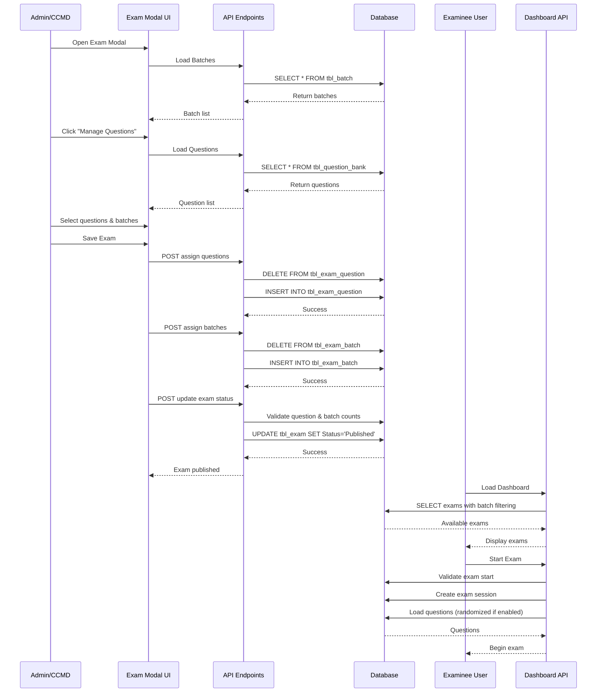
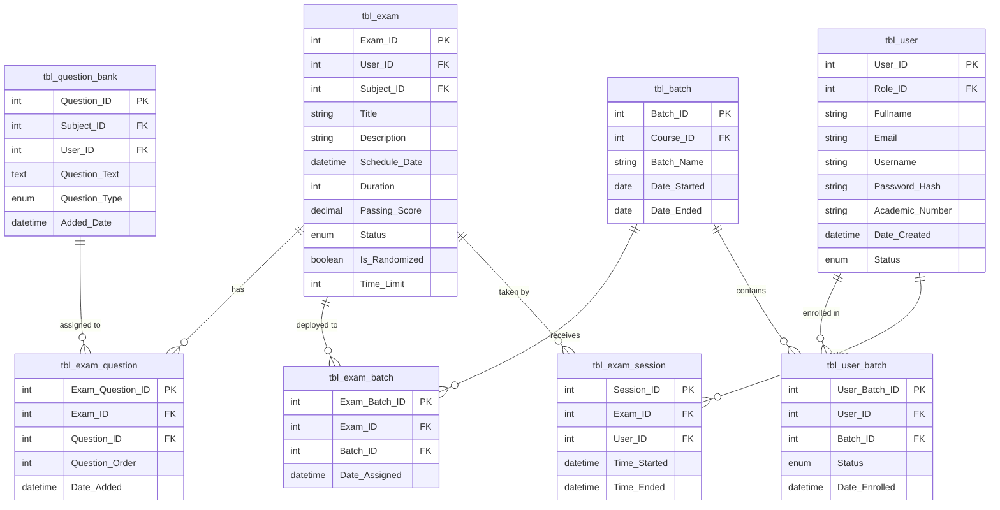

# Design Document: Exam Deployment System

## Overview

The Exam Deployment System extends the existing PNP RTC X exam management platform to enable administrators and CCMD officers to assign questions from the question bank to specific exams and deploy those exams to designated batches of examinees. The system ensures that examinees only see exams that are published, assigned to their batch(es), and not yet completed. It supports question randomization per examinee when enabled.

This design addresses the complete workflow from question assignment through batch deployment to examinee dashboard filtering, ensuring a secure and scalable exam distribution mechanism.

## Architecture

### System Components

The system follows a three-tier architecture:

1. **Presentation Layer**: HTML/JavaScript UI components for exam management and examinee dashboard
2. **Application Layer**: PHP REST API endpoints for CRUD operations on exam assignments
3. **Data Layer**: MySQL database with new linking tables for many-to-many relationships

### Key Architectural Decisions

- **Many-to-Many Relationships**: Use junction tables (tbl_exam_question, tbl_exam_batch, tbl_user_batch) to support flexible assignment patterns
- **Question Randomization**: Implement seed-based shuffling using Session_ID to ensure consistent ordering within a session
- **Batch-Based Access Control**: Filter exams at the API level based on user-batch enrollment and exam-batch assignments
- **Validation at Multiple Levels**: Enforce business rules at database (constraints), API (validation), and UI (feedback) layers

## Components and Interfaces

### Database Schema

#### New Table: tbl_exam_question

Links exams to questions from the question bank.

```sql
CREATE TABLE tbl_exam_question (
  Exam_Question_ID INT(11) NOT NULL AUTO_INCREMENT,
  Exam_ID INT(11) NOT NULL,
  Question_ID INT(11) NOT NULL,
  Question_Order INT(11) NOT NULL DEFAULT 0,
  Date_Added DATETIME NOT NULL DEFAULT CURRENT_TIMESTAMP,
  PRIMARY KEY (Exam_Question_ID),
  UNIQUE KEY uq_exam_question (Exam_ID, Question_ID),
  KEY idx_exam_question_order (Exam_ID, Question_Order),
  CONSTRAINT fk_eq_exam FOREIGN KEY (Exam_ID) REFERENCES tbl_exam(Exam_ID) ON DELETE CASCADE,
  CONSTRAINT fk_eq_question FOREIGN KEY (Question_ID) REFERENCES tbl_question_bank(Question_ID) ON DELETE CASCADE
) ENGINE=InnoDB DEFAULT CHARSET=utf8mb4 COLLATE=utf8mb4_unicode_ci;
```


#### New Table: tbl_exam_batch

Links exams to batches for deployment.

```sql
CREATE TABLE tbl_exam_batch (
  Exam_Batch_ID INT(11) NOT NULL AUTO_INCREMENT,
  Exam_ID INT(11) NOT NULL,
  Batch_ID INT(11) NOT NULL,
  Date_Assigned DATETIME NOT NULL DEFAULT CURRENT_TIMESTAMP,
  PRIMARY KEY (Exam_Batch_ID),
  UNIQUE KEY uq_exam_batch (Exam_ID, Batch_ID),
  KEY idx_exam_batch_batch (Batch_ID),
  CONSTRAINT fk_eb_exam FOREIGN KEY (Exam_ID) REFERENCES tbl_exam(Exam_ID) ON DELETE CASCADE,
  CONSTRAINT fk_eb_batch FOREIGN KEY (Batch_ID) REFERENCES tbl_batch(Batch_ID) ON DELETE CASCADE
) ENGINE=InnoDB DEFAULT CHARSET=utf8mb4 COLLATE=utf8mb4_unicode_ci;
```

#### New Table: tbl_user_batch

Links users (examinees) to batches for enrollment.

```sql
CREATE TABLE tbl_user_batch (
  User_Batch_ID INT(11) NOT NULL AUTO_INCREMENT,
  User_ID INT(11) NOT NULL,
  Batch_ID INT(11) NOT NULL,
  Status ENUM('Active', 'Inactive') NOT NULL DEFAULT 'Active',
  Date_Enrolled DATETIME NOT NULL DEFAULT CURRENT_TIMESTAMP,
  PRIMARY KEY (User_Batch_ID),
  UNIQUE KEY uq_user_batch (User_ID, Batch_ID),
  KEY idx_user_batch_user (User_ID),
  CONSTRAINT fk_ub_user FOREIGN KEY (User_ID) REFERENCES tbl_user(User_ID) ON DELETE CASCADE,
  CONSTRAINT fk_ub_batch FOREIGN KEY (Batch_ID) REFERENCES tbl_batch(Batch_ID) ON DELETE CASCADE
) ENGINE=InnoDB DEFAULT CHARSET=utf8mb4 COLLATE=utf8mb4_unicode_ci;
```

### API Endpoints

#### 1. Question Assignment API (api/masterfiles/exam-questions.php)

**Endpoint**: `POST /api/masterfiles/exam-questions.php?action=assign`

**Purpose**: Assign questions to an exam

**Request Body**:
```json
{
  "exam_id": 1,
  "question_ids": [5, 12, 8, 3]
}
```

**Response**:
```json
{
  "success": true,
  "message": "Questions assigned successfully",
  "count": 4
}
```

**Business Logic**:
- Delete existing assignments for the exam
- Insert new assignments with sequential Question_Order (1, 2, 3, ...)
- Return 404 if exam_id doesn't exist

---

**Endpoint**: `GET /api/masterfiles/exam-questions.php?action=get&exam_id={id}`

**Purpose**: Retrieve assigned questions for an exam

**Response**:
```json
{
  "success": true,
  "data": [
    {
      "Question_ID": 5,
      "Question_Text": "What is the capital of France?",
      "Subject_Name": "Geography",
      "Question_Order": 1,
      "choices": [
        {"Choice_ID": 1, "Choice_Text": "Paris", "Is_Correct": 1},
        {"Choice_ID": 2, "Choice_Text": "London", "Is_Correct": 0}
      ]
    }
  ]
}
```


---

**Endpoint**: `POST /api/masterfiles/exam-questions.php?action=reorder`

**Purpose**: Update question order

**Request Body**:
```json
{
  "exam_id": 1,
  "order": [
    {"question_id": 5, "order": 1},
    {"question_id": 12, "order": 2}
  ]
}
```

**Response**:
```json
{
  "success": true,
  "message": "Question order updated"
}
```

#### 2. Batch Assignment API (api/masterfiles/exam-batches.php)

**Endpoint**: `POST /api/masterfiles/exam-batches.php?action=assign`

**Purpose**: Assign batches to an exam

**Request Body**:
```json
{
  "exam_id": 1,
  "batch_ids": [2, 5, 7]
}
```

**Response**:
```json
{
  "success": true,
  "message": "Batches assigned successfully",
  "count": 3
}
```

**Business Logic**:
- Delete existing batch assignments for the exam
- Insert new assignments
- Return 404 if exam_id doesn't exist

---

**Endpoint**: `GET /api/masterfiles/exam-batches.php?action=get&exam_id={id}`

**Purpose**: Retrieve assigned batches for an exam

**Response**:
```json
{
  "success": true,
  "data": [
    {
      "Batch_ID": 2,
      "Batch_Name": "Batch 2024-A",
      "Course_Name": "Police Officer Training",
      "Section_Name": "Section A"
    }
  ]
}
```

---

**Endpoint**: `GET /api/masterfiles/exam-batches.php?action=list`

**Purpose**: List all batches for selection UI

**Response**:
```json
{
  "success": true,
  "data": [
    {
      "Batch_ID": 2,
      "Batch_Name": "Batch 2024-A",
      "Course_Name": "Police Officer Training",
      "Course_ID": 1
    }
  ]
}
```


#### 3. User-Batch Management API (api/masterfiles/user-batch.php)

**Endpoint**: `POST /api/masterfiles/user-batch.php?action=assign`

**Purpose**: Enroll an examinee in a batch

**Request Body**:
```json
{
  "user_id": 15,
  "batch_id": 2
}
```

**Response**:
```json
{
  "success": true,
  "message": "User enrolled in batch"
}
```

**Validation**:
- Verify user has Role = 'Examinee'
- Return 400 if user is not an examinee

---

**Endpoint**: `POST /api/masterfiles/user-batch.php?action=remove`

**Purpose**: Remove an examinee from a batch

**Request Body**:
```json
{
  "user_id": 15,
  "batch_id": 2
}
```

---

**Endpoint**: `GET /api/masterfiles/user-batch.php?action=batches_by_user&user_id={id}`

**Purpose**: Get all batches for a user

**Response**:
```json
{
  "success": true,
  "data": [
    {
      "Batch_ID": 2,
      "Batch_Name": "Batch 2024-A",
      "Status": "Active",
      "Date_Enrolled": "2024-01-15 10:30:00"
    }
  ]
}
```

---

**Endpoint**: `GET /api/masterfiles/user-batch.php?action=users_by_batch&batch_id={id}`

**Purpose**: Get all users in a batch

**Response**:
```json
{
  "success": true,
  "data": [
    {
      "User_ID": 15,
      "Fullname": "John Doe",
      "Email": "john@example.com",
      "Status": "Active"
    }
  ]
}
```

#### 4. Enhanced Exams List API (api/masterfiles/exams.php)

Modify the existing `GET /api/masterfiles/exams.php?action=list` endpoint to include question and batch counts.

**Enhanced Response**:
```json
{
  "success": true,
  "data": [
    {
      "Exam_ID": 1,
      "Title": "Midterm Exam",
      "Status": "Published",
      "Question_Count": 25,
      "Batch_Count": 3,
      "Course_Name": "Police Training",
      "Subject_Name": "Criminal Law"
    }
  ]
}
```

**SQL Query Enhancement**:
```sql
SELECT e.*, 
       COUNT(DISTINCT eq.Question_ID) as Question_Count,
       COUNT(DISTINCT eb.Batch_ID) as Batch_Count
FROM tbl_exam e
LEFT JOIN tbl_exam_question eq ON e.Exam_ID = eq.Exam_ID
LEFT JOIN tbl_exam_batch eb ON e.Exam_ID = eb.Exam_ID
GROUP BY e.Exam_ID
```


#### 5. Enhanced Examinee Dashboard API (api/examinee/dashboard.php)

Modify the existing dashboard API to filter exams based on batch assignments.

**Endpoint**: `GET /api/examinee/dashboard.php?action=available_exams`

**Purpose**: Get exams available to the authenticated examinee

**Filtering Logic**:
```sql
SELECT DISTINCT e.Exam_ID, e.Title, e.Description, e.Schedule_Date, 
       e.Duration, e.Passing_Score, e.Is_Randomized,
       s.Subject_Name, c.Course_Name,
       COUNT(DISTINCT eq.Question_ID) as Question_Count
FROM tbl_exam e
INNER JOIN tbl_subject s ON e.Subject_ID = s.Subject_ID
INNER JOIN tbl_course c ON s.Course_ID = c.Course_ID
INNER JOIN tbl_exam_batch eb ON e.Exam_ID = eb.Exam_ID
INNER JOIN tbl_user_batch ub ON eb.Batch_ID = ub.Batch_ID
LEFT JOIN tbl_exam_question eq ON e.Exam_ID = eq.Exam_ID
LEFT JOIN tbl_exam_session es ON e.Exam_ID = es.Exam_ID AND es.User_ID = ?
WHERE e.Status = 'Published'
  AND ub.User_ID = ?
  AND ub.Status = 'Active'
  AND (es.Session_ID IS NULL OR es.Time_Ended IS NULL)
GROUP BY e.Exam_ID
ORDER BY e.Schedule_Date ASC
```

**Response**:
```json
{
  "success": true,
  "data": [
    {
      "Exam_ID": 1,
      "Title": "Criminal Law Midterm",
      "Description": "Covers chapters 1-5",
      "Schedule_Date": "2024-03-15 14:00:00",
      "Duration": 60,
      "Passing_Score": 75.00,
      "Subject_Name": "Criminal Law",
      "Course_Name": "Police Training",
      "Question_Count": 25,
      "Is_Randomized": 1
    }
  ]
}
```

#### 6. Exam Publishing Validation API

Enhance the existing `POST /api/masterfiles/exams.php?action=update` endpoint to validate before publishing.

**Validation Logic**:
```php
if ($status === 'Published') {
    // Check question count
    $stmt = $pdo->prepare('SELECT COUNT(*) as cnt FROM tbl_exam_question WHERE Exam_ID = ?');
    $stmt->execute([$exam_id]);
    $qCount = $stmt->fetch(PDO::FETCH_ASSOC)['cnt'];
    
    if ($qCount == 0) {
        return ['success' => false, 'message' => 'Cannot publish exam without questions'];
    }
    
    // Check batch count
    $stmt = $pdo->prepare('SELECT COUNT(*) as cnt FROM tbl_exam_batch WHERE Exam_ID = ?');
    $stmt->execute([$exam_id]);
    $bCount = $stmt->fetch(PDO::FETCH_ASSOC)['cnt'];
    
    if ($bCount == 0) {
        return ['success' => false, 'message' => 'Cannot publish exam without batch assignments'];
    }
}
```


### UI Components

#### 1. Enhanced Exam Modal (html/masterfiles/exams.php)

Add two new sections to the existing exam modal:

**A. Batch Assignment Section**

```html
<div class="mb-3">
    <label class="form-label">Assign to Batches *</label>
    <div id="batchSelectionContainer" class="border rounded p-3" style="max-height: 200px; overflow-y: auto;">
        <!-- Dynamically populated checkboxes -->
    </div>
    <small class="text-muted">
        <span id="batchCount">0</span> batch(es) selected
    </small>
</div>
```

**B. Question Assignment Section**

```html
<div class="mb-3">
    <label class="form-label">Exam Questions</label>
    <div class="d-flex justify-content-between align-items-center">
        <span id="questionCount" class="badge bg-info">0 questions assigned</span>
        <button type="button" class="btn btn-sm btn-outline-primary" id="manageQuestionsBtn">
            <i class="bi bi-list-check"></i> Manage Questions
        </button>
    </div>
</div>
```

#### 2. Question Selection Modal

Create a new modal for selecting questions from the question bank.

```html
<div class="modal fade" id="questionSelectionModal" tabindex="-1">
    <div class="modal-dialog modal-lg">
        <div class="modal-content">
            <div class="modal-header">
                <h5 class="modal-title">Select Questions</h5>
                <button type="button" class="btn-close" data-bs-dismiss="modal"></button>
            </div>
            <div class="modal-body">
                <div class="row mb-3">
                    <div class="col-md-6">
                        <label class="form-label">Filter by Subject</label>
                        <select id="questionSubjectFilter" class="form-select">
                            <option value="">All subjects</option>
                        </select>
                    </div>
                    <div class="col-md-6">
                        <label class="form-label">Search Questions</label>
                        <input type="text" id="questionSearchInput" class="form-control" 
                               placeholder="Search question text...">
                    </div>
                </div>
                <div id="questionListContainer" style="max-height: 400px; overflow-y: auto;">
                    <!-- Question checkboxes populated here -->
                </div>
                <div class="mt-3">
                    <strong>Selected: <span id="selectedQuestionCount">0</span></strong>
                </div>
            </div>
            <div class="modal-footer">
                <button type="button" class="btn btn-outline-secondary" data-bs-dismiss="modal">Cancel</button>
                <button type="button" class="btn btn-primary" id="saveQuestionSelectionBtn">Save Selection</button>
            </div>
        </div>
    </div>
</div>
```


#### 3. Enhanced Exam List Table (html/masterfiles/exams.php)

Add two new columns to the existing exam table:

```html
<thead>
    <tr>
        <th>Course</th>
        <th>Subject</th>
        <th>Title</th>
        <th>Schedule</th>
        <th>Duration (mins)</th>
        <th>Passing %</th>
        <th>Questions</th>  <!-- NEW -->
        <th>Batches</th>    <!-- NEW -->
        <th>Status</th>
        <th>Actions</th>
    </tr>
</thead>
```

**Rendering Logic** (js/masterfiles/exams.js):
```javascript
function renderExams() {
    tbody.innerHTML = filtered.map(e => `
        <tr>
            <td>${escapeHtml(e.Course_Name)}</td>
            <td>${escapeHtml(e.Subject_Name)}</td>
            <td>${escapeHtml(e.Title)}</td>
            <td>${e.Schedule_Date ? new Date(e.Schedule_Date).toLocaleString() : ''}</td>
            <td>${e.Duration || ''}</td>
            <td>${e.Passing_Score != null ? e.Passing_Score : ''}</td>
            <td>
                <span class="badge ${e.Question_Count > 0 ? 'bg-success' : 'bg-warning text-dark'}">
                    ${e.Question_Count || 0}
                </span>
            </td>
            <td>
                <span class="badge ${e.Batch_Count > 0 ? 'bg-info' : 'bg-warning text-dark'}" 
                      title="${e.Batch_Names || 'No batches assigned'}">
                    ${e.Batch_Count || 0}
                </span>
            </td>
            <td><span class="badge ${badgeForStatus(e.Status)}">${escapeHtml(e.Status)}</span></td>
            <td>
                <button class="btn btn-outline btn-sm" onclick="editExam(${e.Exam_ID})">
                    <i class="bi bi-pencil"></i>
                </button>
                <button class="btn btn-outline btn-sm" onclick="deleteExam(${e.Exam_ID})" 
                        style="color: var(--danger-color);">
                    <i class="bi bi-trash"></i>
                </button>
            </td>
        </tr>
    `).join('');
}
```

#### 4. User Management Enhancement (html/masterfiles/users.php)

Add a batch enrollment section when viewing/editing an examinee.

```html
<div class="mb-3" id="batchEnrollmentSection" style="display: none;">
    <label class="form-label">Batch Enrollment</label>
    <div id="userBatchList" class="mb-2">
        <!-- List of enrolled batches -->
    </div>
    <button type="button" class="btn btn-sm btn-outline-primary" id="addToBatchBtn">
        <i class="bi bi-plus"></i> Add to Batch
    </button>
</div>
```


## Data Models

### Exam Question Assignment Model

```javascript
{
  Exam_Question_ID: number,
  Exam_ID: number,
  Question_ID: number,
  Question_Order: number,
  Date_Added: string (ISO datetime),
  // Joined fields
  Question_Text: string,
  Subject_Name: string,
  choices: [
    {
      Choice_ID: number,
      Choice_Text: string,
      Is_Correct: boolean
    }
  ]
}
```

### Exam Batch Assignment Model

```javascript
{
  Exam_Batch_ID: number,
  Exam_ID: number,
  Batch_ID: number,
  Date_Assigned: string (ISO datetime),
  // Joined fields
  Batch_Name: string,
  Course_Name: string,
  Section_Name: string
}
```

### User Batch Enrollment Model

```javascript
{
  User_Batch_ID: number,
  User_ID: number,
  Batch_ID: number,
  Status: 'Active' | 'Inactive',
  Date_Enrolled: string (ISO datetime),
  // Joined fields
  Batch_Name: string,
  Course_Name: string
}
```

### Enhanced Exam Model

```javascript
{
  Exam_ID: number,
  User_ID: number,
  Subject_ID: number,
  Title: string,
  Description: string,
  Schedule_Date: string (ISO datetime),
  Duration: number,
  Passing_Score: number,
  Status: 'Draft' | 'Published' | 'Closed',
  Is_Randomized: boolean,
  Time_Limit: number,
  // New computed fields
  Question_Count: number,
  Batch_Count: number,
  Batch_Names: string (comma-separated),
  // Joined fields
  Subject_Name: string,
  Course_Name: string
}
```


## Correctness Properties

A property is a characteristic or behavior that should hold true across all valid executions of a system—essentially, a formal statement about what the system should do. Properties serve as the bridge between human-readable specifications and machine-verifiable correctness guarantees.

### Property Reflection

After analyzing all acceptance criteria, I identified the following redundancies:

- Properties 1.2, 1.3, 2.2, 2.3, 2.7, 2.8 all test CASCADE delete behavior and can be combined into a single comprehensive property about referential integrity
- Properties 9.4 and 9.5 both test order consistency during an exam session and are redundant
- Properties 4.2 and 6.2 both test idempotent assignment operations and follow the same pattern
- Properties 7.3 and 7.4 test the same conditional rendering pattern for zero counts
- Properties 10.2, 10.4, 10.6, 15.2, 15.4 all test error responses and can be grouped by validation type

After consolidation, the following properties provide unique validation value:

### Property 1: Referential Integrity Cascade

For any exam, batch, question, or user that has associated records in linking tables (tbl_exam_question, tbl_exam_batch, tbl_user_batch), when the parent record is deleted, all associated linking records should also be deleted automatically.

**Validates: Requirements 1.2, 1.3, 2.2, 2.3, 2.7, 2.8**

### Property 2: Unique Assignment Constraints

For any exam and question pair, attempting to create duplicate assignments in tbl_exam_question should fail. Similarly, for any exam and batch pair in tbl_exam_batch, and any user and batch pair in tbl_user_batch, duplicate assignments should be prevented.

**Validates: Requirements 1.5, 2.5, 2.10**

### Property 3: Question Assignment Idempotence

For any exam and any set of question IDs, assigning questions to the exam multiple times should result in the same final state—the exam should have exactly those questions assigned with sequential ordering, regardless of how many times the assignment operation is performed.

**Validates: Requirements 4.2, 4.3**

### Property 4: Batch Assignment Idempotence

For any exam and any set of batch IDs, assigning batches to the exam multiple times should result in the same final state—the exam should be assigned to exactly those batches, regardless of how many times the assignment operation is performed.

**Validates: Requirements 6.2, 6.3**


### Property 5: Sequential Question Ordering

For any exam with assigned questions, the Question_Order values should form a sequential series starting from 1 with no gaps (1, 2, 3, ..., n).

**Validates: Requirements 3.11, 4.3**

### Property 6: Question Retrieval Ordering

For any exam with assigned questions, retrieving the questions via the API should return them ordered by Question_Order in ascending sequence.

**Validates: Requirements 4.6**

### Property 7: API Response Completeness

For any valid API request that returns data (questions, batches, exams), the response should include all required fields as specified in the data models. For questions: Question_ID, Question_Text, Subject_Name, Question_Order. For batches: Batch_ID, Batch_Name, Course_Name. For exams: all exam fields plus Question_Count and Batch_Count.

**Validates: Requirements 4.7, 5.3, 6.6, 7.1, 7.2, 8.7**

### Property 8: Question Reordering Correctness

For any exam with assigned questions, when reordering is applied with a new order mapping, the resulting Question_Order values in the database should match the specified mapping exactly.

**Validates: Requirements 4.9**

### Property 9: Batch Pre-selection Consistency

For any exam being edited that has existing batch assignments, the UI should pre-select exactly those batches that are currently assigned in the database, no more and no less.

**Validates: Requirements 5.5**

### Property 10: Selection Count Accuracy

For any UI component displaying a count of selected items (questions or batches), the displayed count should always equal the actual number of selected checkboxes or items.

**Validates: Requirements 3.8, 3.9, 5.6**

### Property 11: Published Exam Filtering

For any examinee user, the dashboard API should return only exams where Status = 'Published', the exam is assigned to at least one of the user's active batches, and the user has not completed the exam (no tbl_exam_session record with Time_Ended IS NOT NULL).

**Validates: Requirements 8.1, 8.2, 8.3, 8.5**

### Property 12: Randomization Consistency

For any exam with Is_Randomized = 1, when an examinee starts the exam creating a session, the question order should be shuffled based on the Session_ID seed. For the same session, retrieving questions multiple times should return the same order. Different sessions should produce different orders.

**Validates: Requirements 9.2, 9.4, 9.5**

### Property 13: Non-Randomized Order Preservation

For any exam with Is_Randomized = 0, when an examinee starts the exam, the questions should be returned in the original Question_Order sequence without any shuffling.

**Validates: Requirements 9.3**


### Property 14: Exam Start Validation

For any exam start attempt by an examinee, the system should validate three conditions: (1) the exam has at least one assigned question, (2) the exam is assigned to at least one of the user's active batches, and (3) the exam Status = 'Published'. If any condition fails, the appropriate error response should be returned.

**Validates: Requirements 10.1, 10.2, 10.3, 10.4, 10.5, 10.6**

### Property 15: Batch Enrollment Status

For any user enrolled in a batch via the API, the tbl_user_batch record should have Status = 'Active' and Date_Enrolled should be set to the current timestamp at the time of enrollment.

**Validates: Requirements 11.5**

### Property 16: Multiple Batch Enrollment

For any examinee user, the system should allow enrollment in multiple batches simultaneously, with each enrollment creating a separate tbl_user_batch record.

**Validates: Requirements 11.6**

### Property 17: Role-Based Batch Enrollment

For any user with Role other than 'Examinee', attempting to enroll them in a batch should fail with HTTP 400 and error message "Only examinees can be assigned to batches".

**Validates: Requirements 11.7, 12.2, 12.3**

### Property 18: Enrollment Record Creation

For any valid user_id (Examinee role) and batch_id, calling the assign endpoint should create a tbl_user_batch record with Status = 'Active'.

**Validates: Requirements 12.4**

### Property 19: Question Count Display

For any exam displayed in the exam list or exam modal, the question count should equal the number of records in tbl_exam_question for that exam.

**Validates: Requirements 7.1, 13.1**

### Property 20: Batch Count Display

For any exam displayed in the exam list or exam modal, the batch count should equal the number of records in tbl_exam_batch for that exam.

**Validates: Requirements 7.2, 14.1**

### Property 21: Zero Count Warning Display

For any exam with Question_Count = 0 or Batch_Count = 0, the UI should display a warning indicator along with the zero count.

**Validates: Requirements 7.3, 7.4, 13.3, 14.3**

### Property 22: Real-Time Count Updates

For any UI component displaying question or batch counts, when the underlying selection changes, the displayed count should update immediately without requiring a page refresh or modal close.

**Validates: Requirements 13.4, 14.4**

### Property 23: Publishing Validation

For any exam being updated to Status = 'Published', the system should validate that Question_Count > 0 and Batch_Count > 0. If either validation fails, the system should return HTTP 400 with an appropriate error message. For exams with Status = 'Draft' or 'Closed', no such validation should be performed.

**Validates: Requirements 15.1, 15.2, 15.3, 15.4, 15.5**

### Property 24: Invalid Exam ID Error Handling

For any API endpoint that accepts an exam_id parameter, if the exam_id does not exist in tbl_exam, the system should return HTTP 404 with error message "Exam not found".

**Validates: Requirements 4.4, 6.4**


## Error Handling

### Database Errors

- **Foreign Key Violations**: Return HTTP 400 with message indicating the constraint violation (e.g., "Cannot assign question: Question does not exist")
- **Unique Constraint Violations**: Return HTTP 409 with message "Duplicate assignment detected"
- **Connection Failures**: Return HTTP 503 with message "Database temporarily unavailable"

### Validation Errors

- **Missing Required Fields**: Return HTTP 400 with message listing missing fields
- **Invalid Exam ID**: Return HTTP 404 with message "Exam not found"
- **Invalid User Role**: Return HTTP 400 with message "Only examinees can be assigned to batches"
- **Publishing Without Questions**: Return HTTP 400 with message "Cannot publish exam without questions"
- **Publishing Without Batches**: Return HTTP 400 with message "Cannot publish exam without batch assignments"
- **Starting Exam Without Authorization**: Return HTTP 403 with message "You are not authorized to take this exam"
- **Starting Unpublished Exam**: Return HTTP 400 with message "This exam is not available"

### Authorization Errors

- **Unauthenticated Access**: Return HTTP 401 with message "Authentication required"
- **Insufficient Permissions**: Return HTTP 403 with message "Unauthorized access"
- **Role Mismatch**: Return HTTP 403 with message "This action requires Admin or CCMD role"

### Client-Side Error Handling

- Display user-friendly error messages using SweetAlert2 modals
- Log detailed errors to browser console for debugging
- Provide retry mechanisms for transient failures
- Validate form inputs before submission to reduce server errors

## Testing Strategy

### Unit Testing

Unit tests will focus on specific examples, edge cases, and integration points:

- **API Endpoint Tests**: Verify each endpoint returns correct status codes and response formats
- **Database Schema Tests**: Verify tables exist with correct columns and constraints
- **UI Component Tests**: Verify modals render with correct elements and event handlers
- **Edge Cases**: Test empty result sets, zero counts, missing data
- **Error Conditions**: Test invalid inputs, missing parameters, unauthorized access

### Property-Based Testing

Property-based tests will verify universal properties across all inputs using PHPUnit with a property testing extension or a JavaScript library like fast-check for frontend tests:

- **Configuration**: Minimum 100 iterations per property test
- **Tagging**: Each test tagged with format: `Feature: exam-deployment-system, Property {number}: {property_text}`
- **Coverage**: Each of the 24 correctness properties will have exactly one property-based test

### Test Libraries

- **Backend (PHP)**: PHPUnit for unit tests, PHPUnit with Eris or similar for property-based tests
- **Frontend (JavaScript)**: Jest or Mocha for unit tests, fast-check for property-based tests
- **Database**: Use test database with fixtures for reproducible tests
- **API Testing**: Use Axios mock adapter or similar for isolated frontend tests

### Test Data Generation

- **Random Exam IDs**: Generate valid and invalid exam IDs
- **Random Question Sets**: Generate arrays of question IDs with varying lengths
- **Random Batch Sets**: Generate arrays of batch IDs with varying lengths
- **Random User Roles**: Generate users with different roles (Admin, CCMD, Examinee)
- **Random Session IDs**: Generate session IDs for randomization testing
- **Edge Cases**: Empty arrays, null values, very large arrays


## Implementation Considerations

### Database Migration

The three new tables (tbl_exam_question, tbl_exam_batch, tbl_user_batch) should be created via a migration script that:

1. Checks if tables already exist before creating
2. Creates tables with proper indexes and constraints
3. Validates foreign key references exist
4. Provides rollback capability

### Performance Optimization

- **Batch Loading**: Load all batches once and cache in JavaScript for UI responsiveness
- **Question Pagination**: For exams with many questions, implement pagination in the question selection modal
- **Index Usage**: Ensure queries use the created indexes (Exam_ID, Question_Order), (Batch_ID), (User_ID)
- **Query Optimization**: Use JOIN operations efficiently to minimize database round trips

### Security Considerations

- **SQL Injection Prevention**: Use prepared statements for all database queries
- **XSS Prevention**: Escape all user-generated content before rendering in HTML
- **CSRF Protection**: Implement CSRF tokens for state-changing operations
- **Role-Based Access Control**: Verify user role on every API endpoint
- **Session Management**: Validate session tokens on every request

### UI/UX Considerations

- **Loading States**: Show spinners while loading questions or batches
- **Confirmation Dialogs**: Confirm destructive actions (delete assignments, remove from batch)
- **Validation Feedback**: Show real-time validation errors before submission
- **Accessibility**: Ensure keyboard navigation works for all interactive elements
- **Responsive Design**: Ensure modals and tables work on various screen sizes

### Data Consistency

- **Transaction Boundaries**: Wrap assignment operations in database transactions
- **Atomic Updates**: Ensure delete-then-insert operations for assignments are atomic
- **Referential Integrity**: Rely on database constraints to maintain consistency
- **Optimistic Locking**: Consider version fields if concurrent edits are expected

## System Workflow Diagram




## Database Schema Diagram



## Summary

This design provides a comprehensive solution for the Exam Deployment System that:

1. Establishes robust many-to-many relationships between exams, questions, batches, and users through junction tables
2. Implements secure API endpoints with proper validation and error handling
3. Enhances the UI with intuitive question and batch assignment interfaces
4. Filters examinee dashboards based on batch enrollment and exam assignments
5. Supports question randomization with session-based consistency
6. Validates exam configuration before publishing to prevent incomplete deployments
7. Maintains data integrity through database constraints and transaction boundaries

The system is designed to be scalable, maintainable, and secure, with clear separation of concerns between the presentation, application, and data layers.
